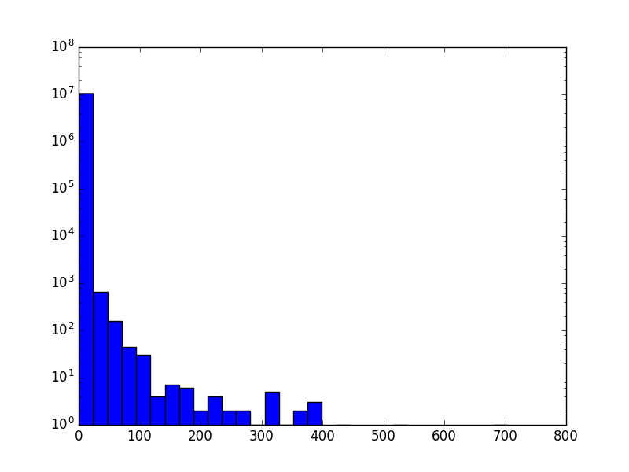
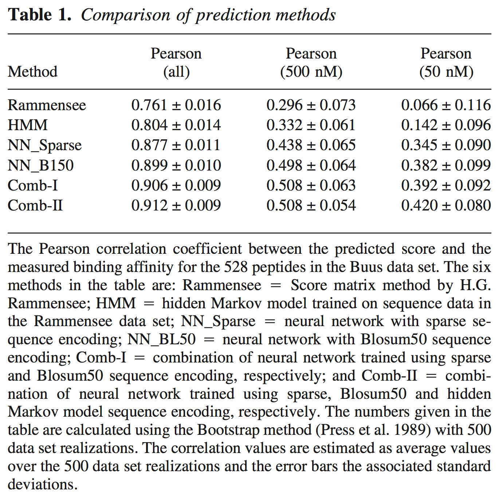

# Modeling epitope affnity to MHC molecules using multiple SVM kernels

Repository for Code relating to my Foundations of Computational Biology and Bioinformatics II Project

_Peter DeFord, Spring 2017_

------------------------------------------------------------------------------------------------

## Introduction

This `README` will serve to document my progress addressing the problem of modeling the affinity for short peptide sequences to MHC molecules. For a more detailed introduction, please see my [proposal](DeFord_proposal.pdf).

## Progress

#### March 28, 2017:

* PMD: Download [data from the MHCflurry paper](https://www.dropbox.com/sh/t59rdyvna6tktd2/AAAGUFvx56jBhOngsXhrEnzaa?dl=0), provided by Rohit

#### April 5, 2017:

* PMD: Collect features to use for encoding the features.

[BLOSUM50 Matrix](https://www.ncbi.nlm.nih.gov/IEB/ToolBox/C_DOC/lxr/source/data/BLOSUM50)

|**+**|   A|   R|   N|   D|   C|   Q|   E|   G|   H|   I|   L|   K|   M|   F|   P|   S|   T|   W|   Y|   V|   B|   J|   Z|   X|   -|
|-----|---:|---:|---:|---:|---:|---:|---:|---:|---:|---:|---:|---:|---:|---:|---:|---:|---:|---:|---:|---:|---:|---:|---:|---:|---:|
|**A**|   5|  -2|  -1|  -2|  -1|  -1|  -1|   0|  -2|  -1|  -2|  -1|  -1|  -3|  -1|   1|   0|  -3|  -2|   0|  -2|  -2|  -1|  -1|  -5|
|**R**|  -2|   7|  -1|  -2|  -4|   1|   0|  -3|   0|  -4|  -3|   3|  -2|  -3|  -3|  -1|  -1|  -3|  -1|  -3|  -1|  -3|   0|  -1|  -5|
|**...**| ...| ...| ...| ...| ...| ...| ...| ...| ...| ...| ...| ...| ...| ...| ...| ...| ...| ...| ...| ...| ...| ...| ...| ...| ...|

pKa's obtained [here](http://academics.keene.edu/rblatchly/Chem220/hand/npaa/aawpka.htm).
For those amino acids without a pKa notated for their side chain
use the value of a standard alkane, which is around 50.

|**+**| non-polar | polar | charged |  pI   |Amine pKa|CO2H pKa| R pKa |
|-----|:---------:|:-----:|:-------:|------:|--------:|-------:|------:|
|**A**|    1      |   0   |    0    |  6.02 |  9.87   |  2.35  |     - |
|**R**|    0      |   0   |    1    | 10.76 |  8.99   |  1.82  | 12.48 |
|**...**|   ...     |  ...  |   ...   |  .... |  ....   |  ....  | ..... |

Helical propensity, from [table 2](https://www.ncbi.nlm.nih.gov/pmc/articles/PMC2142718/pdf/8061613.pdf)

| AA     | s-Value      | w-Value      | -RTln(w)        | ddG            |
|--------|:------------:|:------------:|:---------------:|:--------------:|
| **A**  | 1.540        | 1.610        | -0.258          | -1.88          |
| **R**  | 1.100        | 1.200        | -0.047          | -1.67          |
| **...**| .....        | .....        |  .....          | .....          |

[Properties](http://www.sigmaaldrich.com/life-science/metabolomics/learning-center/amino-acid-reference-chart.html#hydro).
Again, missing pKa replaced with 50 in the table

|AA   |  MW    |residue MW| CO2H pKa | NH2 pKa | pKa R  | pI    |
|:---:|-------:|--------:|---------:|--------:|-------:|------:|
|**A**|  89.10 |   71.08 | 2.34     |  9.69   | -      |  6.00 |
|**R**| 174.20 |  156.19 | 2.17     |  9.04   | 12.48  | 10.76 |
| ... |  ...   |    ...  | ...      |  ...    |  ...   |   ... |

[Hydrophobicity Index](http://www.sigmaaldrich.com/life-science/metabolomics/learning-center/amino-acid-reference-chart.html#hydro)

|AA   | pH2 |  pH7 |
|:---:|----:|-----:|
|**L**| 100 |   97 |
|**H**| -42 |    8 |
| ... | ... |  ... |

Download the full human proteome from [UniProt](http://www.uniprot.org/uniprot/?query=reviewed%3Ayes+AND+proteome%3Aup000005640).

Using a script [`count_kmer_freq.py`](scripts/count_kmer_freq.py) I extracted the kmer frequency for all kmers present in the proteome with `k = [4, 6, 8, 10]`. The top 5 kmers for each are:

| k = 4  | 6        | 8          | 10           |
|:------:|:--------:|:----------:|:------------:|
| `EEEE` | `HTGEKP` | `IHTGEKPY` | `QQQQQQQQQQ` |
| `PPPP` | `TGEKPY` | `RIHTGEKP` | `IHTGEKPYKC` |
| `AAAA` | `EEEEEE` | `QQQQQQQQ` | `HQRIHTGEKP` |
| `SSSS` | `AAAAAA` | `HTGEKPYK` | `SSSSSSSSSS` |
| `LLLL` | `IHTGEK` | `TGEKPYKC` | `EEEEEEEEEE` |
| `HTGE` | `PPPPPP` | `EEEEEEEE` | `AAAAAAAAAA` |
| `GEKP` | `ECGKAF` | `AAAAAAAA` | `QRIHTGEKPY` |
| `TGEK` | `QQQQQQ` | `HTGEKPYE` | `KPYKCEECGK` |
| `GGGG` | `SSSSSS` | `TGEKPYEC` | `YKCEECGKAF` |
| `EKPY` | `EKPYKC` | `SSSSSSSS` | `HTGEKPYKCE` |

At each _k_ the distribution looks like this example from `k = 10`. Note: The y-axis is log scaled:

As a basis for my comparisons, I will do some initial comparisons to these summaries listed in table 1 of the netMHC paper:

#### April 7, 2017

* I am going to focus on peptides length 9 or 10
* Given an alphabet of 20 amino acids, this corresponds to 0.5-10 trillion possible peptides.
* There are only about 20,000 peptides sampled across all human alleles in this data set. This is probably an overestimation as well, because some shorter peptides may be subsequences of the longer peptides.
* The netMHC paper provides a 6-letter alphabet to cut down on the dimensionality. This new alphabet is as follows:
  * A = "GAS"
  * B = "CTDV"
  * C = "P"
  * D = "NLIQMEH"
  * E = "KFRY"
  * F = "W"
* This corresponds to only 10-60 million possible peptides.
* Manual inspection of the 10mer peptides with the highest and lowest affinities for HLA-A-0201, we see closely related peptides.
  * Highest affinity sequences:
    - `FLLPLTSLVI` 
    - `YLFDYPHFEA`
    - `FLPIIFDAFL`
    - `LLLEWLAEVV`
    - `ELYNKPLYEV`
  * Lowest affinity sequences
    - `TPGPGVRYPL`
    - `ALYLVCGERG`
    - `TNIRQAGVQY`
    - `RQAGVQYSRA`
    - `IRQAGVQYSR`
  * High affinity sequences seem to have `L*EV`, `F*P`.
  * Low affinity sequences seem to have `GC*Y`.
  * If these are the significant sequences, they seem to __not be position dependent__. This is significant because it means we can learn a smaller model with few parameters, and then find the best score on any given peptide.

#### April 10, 2017

Today I took the datasets I have collected and did a simple classification test to assess baseline performance of each feature. I used ten-fold cross validation, and took the average AUC. As a start I used logistic regression, random forest, and a support vector machine with the _rbf_ kernel, as implemented in `sklearn` in `python`.

| Feature          | logit | RFC   | SVM (rbf) |
|:-----------------|:-----:|:-----:|:---------:|
| B50_rows         | 0.939 | 0.861 | 0.825     |
| basic_characters | 0.811 | 0.700 | 0.796     |
| pKas             | 0.771 | 0.818 | 0.666     |
| helical          | 0.747 | 0.785 | 0.717     |
| sigma_properties | 0.842 | 0.841 | 0.517     |
| hydrophobicity   | 0.849 | 0.843 | 0.506     |
| bin_AA           | 0.942 | 0.861 | 0.910     |
| netmhc_surface   | 0.781 | 0.711 | 0.767     |
| count            | 0.598 | 0.630 | 0.505     |
| bin_AA/ B50_rows/ sigma_properties | 0.939 | 0.872 | 0.630 |
| All together     | 0.937 | 0.865 | 0.517     |

Surprisingly, Logistic Regression performed better than the other two methods. Given the complex nature of the problem, this is surprising as Logistic Regression is a linear model. It is also surpising that the best performing feature was just a vector with binary indicators for each amino acid at each position.

