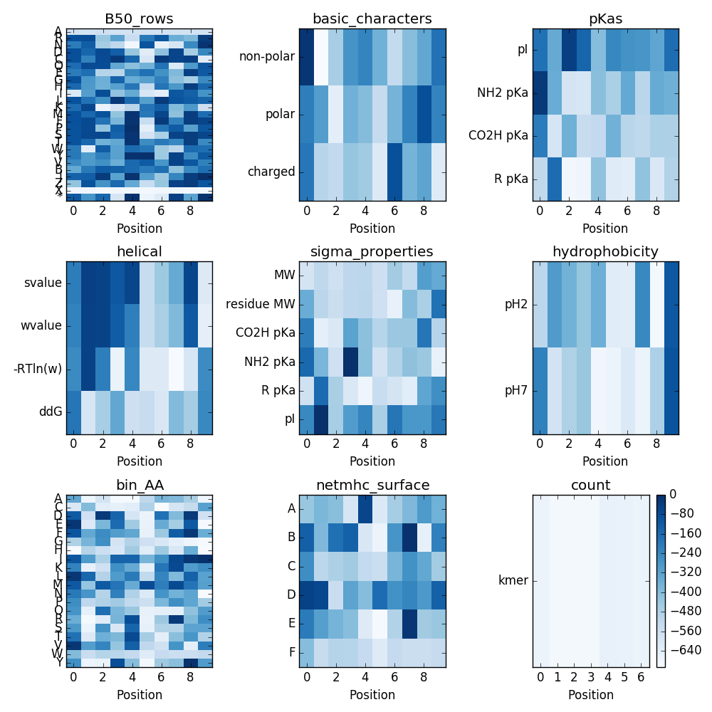

# Modeling epitope affnity to MHC molecules using multiple SVM kernels

Repository for Code relating to my Foundations of Computational Biology and Bioinformatics II Project

_Peter DeFord, Spring 2017_

------------------------------------------------------------------------------------------------

## Introduction

This `README` will serve to document my progress addressing the problem of modeling the affinity for short peptide sequences to MHC molecules. For a more detailed introduction, please see my [proposal](DeFord_proposal.pdf).

## Progress

#### March 28, 2017:

* PMD: Download [data from the MHCflurry paper](https://www.dropbox.com/sh/t59rdyvna6tktd2/AAAGUFvx56jBhOngsXhrEnzaa?dl=0), provided by Rohit

#### April 5, 2017:

* PMD: Collect features to use for encoding the features.

[BLOSUM50 Matrix](https://www.ncbi.nlm.nih.gov/IEB/ToolBox/C_DOC/lxr/source/data/BLOSUM50)

|**+**|   A|   R|   N|   D|   C|   Q|   E|   G|   H|   I|   L|   K|   M|   F|   P|   S|   T|   W|   Y|   V|   B|   J|   Z|   X|   -|
|-----|---:|---:|---:|---:|---:|---:|---:|---:|---:|---:|---:|---:|---:|---:|---:|---:|---:|---:|---:|---:|---:|---:|---:|---:|---:|
|**A**|   5|  -2|  -1|  -2|  -1|  -1|  -1|   0|  -2|  -1|  -2|  -1|  -1|  -3|  -1|   1|   0|  -3|  -2|   0|  -2|  -2|  -1|  -1|  -5|
|**R**|  -2|   7|  -1|  -2|  -4|   1|   0|  -3|   0|  -4|  -3|   3|  -2|  -3|  -3|  -1|  -1|  -3|  -1|  -3|  -1|  -3|   0|  -1|  -5|
|**...**| ...| ...| ...| ...| ...| ...| ...| ...| ...| ...| ...| ...| ...| ...| ...| ...| ...| ...| ...| ...| ...| ...| ...| ...| ...|

pKa's obtained [here](http://academics.keene.edu/rblatchly/Chem220/hand/npaa/aawpka.htm).
For those amino acids without a pKa notated for their side chain
use the value of a standard alkane, which is around 50.

|**+**| non-polar | polar | charged |  pI   |Amine pKa|CO2H pKa| R pKa |
|-----|:---------:|:-----:|:-------:|------:|--------:|-------:|------:|
|**A**|    1      |   0   |    0    |  6.02 |  9.87   |  2.35  |     - |
|**R**|    0      |   0   |    1    | 10.76 |  8.99   |  1.82  | 12.48 |
|**...**|   ...     |  ...  |   ...   |  .... |  ....   |  ....  | ..... |

Helical propensity, from [table 2](https://www.ncbi.nlm.nih.gov/pmc/articles/PMC2142718/pdf/8061613.pdf)

| AA     | s-Value      | w-Value      | -RTln(w)        | ddG            |
|--------|:------------:|:------------:|:---------------:|:--------------:|
| **A**  | 1.540        | 1.610        | -0.258          | -1.88          |
| **R**  | 1.100        | 1.200        | -0.047          | -1.67          |
| **...**| .....        | .....        |  .....          | .....          |

[Properties](http://www.sigmaaldrich.com/life-science/metabolomics/learning-center/amino-acid-reference-chart.html#hydro).
Again, missing pKa replaced with 50 in the table

|AA   |  MW    |residue MW| CO2H pKa | NH2 pKa | pKa R  | pI    |
|:---:|-------:|--------:|---------:|--------:|-------:|------:|
|**A**|  89.10 |   71.08 | 2.34     |  9.69   | -      |  6.00 |
|**R**| 174.20 |  156.19 | 2.17     |  9.04   | 12.48  | 10.76 |
| ... |  ...   |    ...  | ...      |  ...    |  ...   |   ... |

[Hydrophobicity Index](http://www.sigmaaldrich.com/life-science/metabolomics/learning-center/amino-acid-reference-chart.html#hydro)

|AA   | pH2 |  pH7 |
|:---:|----:|-----:|
|**L**| 100 |   97 |
|**H**| -42 |    8 |
| ... | ... |  ... |

Download the full human proteome from [UniProt](http://www.uniprot.org/uniprot/?query=reviewed%3Ayes+AND+proteome%3Aup000005640).

Using a script [`count_kmer_freq.py`](scripts/count_kmer_freq.py) I extracted the kmer frequency for all kmers present in the proteome with `k = [4, 6, 8, 10]`. The top 5 kmers for each are:

| k = 4  | 6        | 8          | 10           |
|:------:|:--------:|:----------:|:------------:|
| `EEEE` | `HTGEKP` | `IHTGEKPY` | `QQQQQQQQQQ` |
| `PPPP` | `TGEKPY` | `RIHTGEKP` | `IHTGEKPYKC` |
| `AAAA` | `EEEEEE` | `QQQQQQQQ` | `HQRIHTGEKP` |
| `SSSS` | `AAAAAA` | `HTGEKPYK` | `SSSSSSSSSS` |
| `LLLL` | `IHTGEK` | `TGEKPYKC` | `EEEEEEEEEE` |
| `HTGE` | `PPPPPP` | `EEEEEEEE` | `AAAAAAAAAA` |
| `GEKP` | `ECGKAF` | `AAAAAAAA` | `QRIHTGEKPY` |
| `TGEK` | `QQQQQQ` | `HTGEKPYE` | `KPYKCEECGK` |
| `GGGG` | `SSSSSS` | `TGEKPYEC` | `YKCEECGKAF` |
| `EKPY` | `EKPYKC` | `SSSSSSSS` | `HTGEKPYKCE` |

At each _k_ the distribution looks like this example from `k = 10`. Note: The y-axis is log scaled:

As a basis for my comparisons, I will do some initial comparisons to these summaries listed in table 1 of the netMHC paper:

#### April 7, 2017

* I am going to focus on peptides length 9 or 10
* Given an alphabet of 20 amino acids, this corresponds to 0.5-10 trillion possible peptides.
* There are only about 20,000 peptides sampled across all human alleles in this data set. This is probably an overestimation as well, because some shorter peptides may be subsequences of the longer peptides.
* The netMHC paper provides a 6-letter alphabet to cut down on the dimensionality. This new alphabet is as follows:
  * A = "GAS"
  * B = "CTDV"
  * C = "P"
  * D = "NLIQMEH"
  * E = "KFRY"
  * F = "W"
* This corresponds to only 10-60 million possible peptides.
* Manual inspection of the 10mer peptides with the highest and lowest affinities for HLA-A-0201, we see closely related peptides.
  * Highest affinity sequences:
    - `FLLPLTSLVI` 
    - `YLFDYPHFEA`
    - `FLPIIFDAFL`
    - `LLLEWLAEVV`
    - `ELYNKPLYEV`
  * Lowest affinity sequences
    - `TPGPGVRYPL`
    - `ALYLVCGERG`
    - `TNIRQAGVQY`
    - `RQAGVQYSRA`
    - `IRQAGVQYSR`
  * High affinity sequences seem to have `L*EV`, `F*P`.
  * Low affinity sequences seem to have `GC*Y`.
  * If these are the significant sequences, they seem to __not be position dependent__. This is significant because it means we can learn a smaller model with few parameters, and then find the best score on any given peptide.

#### April 10, 2017

Today I took the datasets I have collected and did a simple classification test to assess baseline performance of each feature. I used ten-fold cross validation, and took the average AUC. As a start I used logistic regression, random forest, and a support vector machine with the _rbf_ kernel, as implemented in `sklearn` in `python`. The script used is [class_test.py](scripts/class_test.py)

| Feature          | logit | RFC   | SVM (rbf) |
|:-----------------|:-----:|:-----:|:---------:|
| bin_AA           | 0.942 | 0.861 | 0.910     |
| B50_rows         | 0.939 | 0.861 | 0.825     |
| hydrophobicity   | 0.849 | 0.843 | 0.506     |
| sigma_properties | 0.842 | 0.841 | 0.517     |
| basic_characters | 0.811 | 0.700 | 0.796     |
| netmhc_surface   | 0.781 | 0.711 | 0.767     |
| pKas             | 0.771 | 0.818 | 0.666     |
| helical          | 0.747 | 0.785 | 0.717     |
| count            | 0.598 | 0.630 | 0.505     |
| ---------------- | ----- | ----- | -----     |
| bin_AA/ B50_rows/ sigma_properties | 0.939 | 0.872 | 0.630 |
| All together     | 0.937 | 0.865 | 0.517     |

Surprisingly, Logistic Regression performed better than the other two methods. Given the complex nature of the problem, this is surprising as Logistic Regression is a linear model. It is also surpising that the best performing feature was just a vector with binary indicators for each amino acid at each position.

Since the indicator for each AA at each position was the best performing feature, I was curious how each AA influenced each position. I used the linear LogIt model, and retrieved the coefficients. Then I normalized the coefficients to range from 0 to 1, sorted by value, and plotted each AA at each position, where the size coincides with the value. Small values are selected against, large values are selected for. The amino acids here are colored by their chemical character. i.e. green are polar molecules, purple and neutral, blue is basic, red is acidic, and black are hydrophobic. 

As you can see, there seemes to be a selection for basic molecules in general, and against polar or hydrophobic molecules.

This, coupled with the observation from earlier regarding potential positional independence, prompted me to try collecting my features independent of position, by simply summing the vectors. In this approach, the binary indicator would become an accumulator for the number of times an AA occurs in a given sequence, and ignores position completely. (done by setting `flag = False` in the script). The performance is summarized in the table below.

| Feature          | logit | RFC   | SVM (rbf) |
|:-----------------|:-----:|:-----:|:---------:|
| bin_AA           | 0.818 | 0.748 | 0.817     |
| B50_rows         | 0.818 | 0.762 | 0.637     |
| hydrophobicity   | 0.775 | 0.698 | 0.603     |
| basic_characters | 0.751 | 0.733 | 0.696     |
| sigma_properties | 0.742 | 0.690 | 0.575     |
| helical          | 0.698 | 0.603 | 0.618     |
| pKas             | 0.685 | 0.664 | 0.690     |
| count            | 0.598 | 0.612 | 0.505     |
| netmhc_surface   | 0.580 | 0.526 | 0.548     |
| ---------------- | ----- | ----- | -----     |
| bin_AA/ B50_rows/ sigma_properties | 0.818 | 0.760 | 0.631 |
| All together     | 0.818 | 0.764 | 0.500     |

Some performance is lost, demonstrating the there are indeed positional factors, though not necessarily strong ones.

#### April 24, 2017

* PMD: Using Recursive Feature Elimination, I was checking to see which types of features were most informative, as well as which positions in the sequence. (`scripts/rfe.py`)
  - The RFE algorithm, used with a step size of 10, and 3-fold cross validation, 97 out of the 707 position specific features are identified as important.
  - 
  - Each feature was ranked by its importance by the algorithm. The positions of the important features ranked in the top 97 (the number of features identified by RFE) were plotted in a histogram (below). As you can see, they tend to be on the ends of the peptide, or the very center.
  - 
  - In order to get a better idea if there are any patterns in the informative features, I plotted each feature by its position, and colored them based on their rank in the RFE weighting. In the matrix, the darker the color, the higher it is ranked.
  - 
  - The most important features are mostly from the BLOSUM50 matrix and binary representations of the Amino Acids sequences, and a few helical features.

#### April 25, 2017

* PMD: Since simple sequence features seem to be generally the most informative, and there seems to be some evidence that it is position independent, I decided to look at how explanatory kmers were. To accomplish this, I learned an overall "enrichment" for each kmer. This was the sum of the measurements for each peptide the kmer appears in. Then to score a given sequence, I summed up the composite kmer enrichments. I tried this on two sets:
  - The first was the full set of peptides and measurements for human HLA-A-0201, length 10 peptides. (Orange)
  - The second was trained on a random 80% subset of human HLA-A-0201, and tested on the remaining 20%. (Blue)
  - [`motif.py`](scripts/motif.py)
  
 
 
 Pearson correlation coefficients for composite enrichments vs measured affinity
 
 | K  | Full | 80% |
|---:|:----:|:---:|
|  1 | -0.073 | -0.053 |
|  2 | 0.099 | 0.045 |
|  3 | 0.594 | 0.230 |
|  4 | 0.834 | 0.337 |
| **5**| **0.870** | **0.361** |
|  6 | 0.891 | 0.349 |
|  7 | 0.914 | 0.343 |
|  8 | 0.941 | 0.307 |
|  9 | 0.971 | 0.277 |

As you can see, it is prone to overtraining. This might indicate that with enough representation of each of the kmers, we might be able to correctly learn the trend, but there are too many kmers to encounter. As such, on the subsetted data `k = 5` performed the best, but the pearson correlation coefficient was only `0.361`.

I will attempt to use a Markov Model to represent the underlying distribution of sequences, in an attempt to estimate the 'enrichments' for the unseen kmers, as you might do with a SELEX experiment. I will also try other strategies for measuring 'enrichment' such as median value instead of sum.
